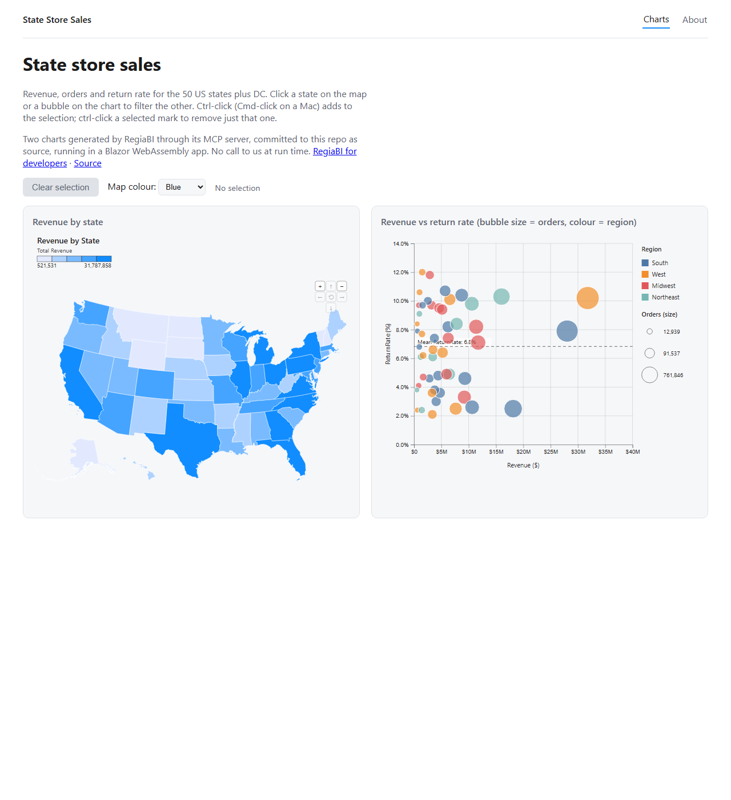

# RegiaBI charts in Blazor

> **Make Generative AI for Charts *Better*.**

RegiaBI hands you a chart that fits your data on the first try, as source you own, and it runs in your
Blazor app or any web page on a free, open-source runtime with no call back to us.

**[Open the live page](https://codexguy.github.io/bicharts-blazor-demo/)**: it's served from GitHub
Pages, and it makes zero calls to us, running on `d3` and `@bicharts/chart-host` alone.
· [RegiaBI for developers](https://bizintelligencechampions.com/regiabi/developers?loc=ghblz)

A standalone Blazor WebAssembly app on .NET 10 that renders two charts generated by RegiaBI. It was
built from an empty folder by a coding agent that had only the RegiaBI MCP server, its agent skill,
the published npm packages, a CSV and a one-page brief.



## What it demonstrates

| | |
| --- | --- |
| **USA Choropleth (by state)** | The 50 states plus DC shaded by revenue, over geometry bundled in chart-host and fetched only when the map asks for it |
| **Bubble chart** | Revenue against return rate, one bubble per state, sized by orders and coloured by region |
| **Cross-chart filtering** | Works both ways: click a state to filter the bubbles, or a bubble to highlight its state on the map |
| **Selection** | The clicked chart shows its selection; Ctrl-click (Cmd-click on a Mac) adds or removes one mark |
| **Getting back out** | Click the mark again, click empty canvas, or press Clear |
| **Live restyle** | The map colour control repaints the map's colour ramp. Nothing is regenerated |
| **Light and dark** | The page follows the reader's preference, and the charts draw for the canvas they sit on |

Both charts were produced by the MCP `generate_chart` tool on 2026-09-25 from
`BlazorChartsDemo/state_store_sales.csv` and committed under `BlazorChartsDemo/wwwroot/charts/`.

## The architectural point

**A BIC chart is generated source you own, not a service you call.**

Design time (once, per chart):

```text
agent → MCP generate_chart → chart.js + data.sample.json (+ data.geo.json for a map) → committed
```

Run time (every page load): **no API key, no network call, no per-render cost, works offline.** The
only runtime dependencies are `d3` and `@bicharts/chart-host`, bundled by esbuild during `dotnet build`.

## How it is wired

- `BlazorChartsDemo/Scripts/bic.entry.js` is the only JavaScript the app owns. It builds one
  cross-filter group from chart-host's framework-free `createChartGroup`, mounts each chart with
  `createChartHost`, and keeps every chart payload on the JavaScript side.
- `Components/BicChartGroup.razor` holds that group and reports the selection to .NET as source row
  indices. `Components/BicChart.razor` hands the group an element, and disposes cleanly.
- All interop happens in `OnAfterRenderAsync(firstRender)`, so the same components run under Blazor
  Server or Auto.

Step-by-step instructions for building this from an empty folder are in
[docs/WALKTHROUGH.md](docs/WALKTHROUGH.md).

## Running it

```bash
cd BlazorChartsDemo
dotnet run            # the build runs npm ci and the esbuild bundle itself
dotnet publish -c Release
```

You need the .NET 10 SDK and Node 20 or later. Every push to `master` rebuilds the page and publishes
it to GitHub Pages (`.github/workflows/pages.yml`). The workflow sets `<base href>` to
`/bicharts-blazor-demo/` and adds the two files a Blazor app needs on Pages: `.nojekyll` (Jekyll
would drop `_framework/`) and a `404.html` copy of `index.html` (so a deep link to `/about` boots the
app).

## Licence

The demo is MIT (see `LICENSE`). `@bicharts/chart-host` is Apache-2.0 and bundles reference data from
GeoNames under CC BY 4.0: this work includes data from GeoNames (https://www.geonames.org/), licensed
under CC BY 4.0.
